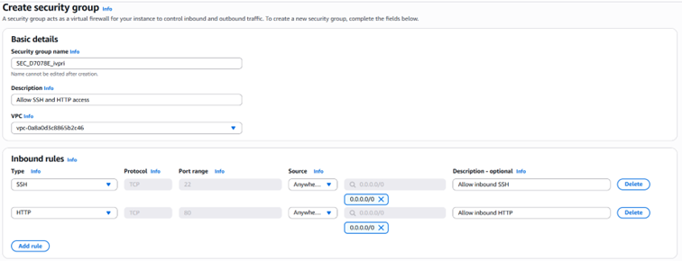
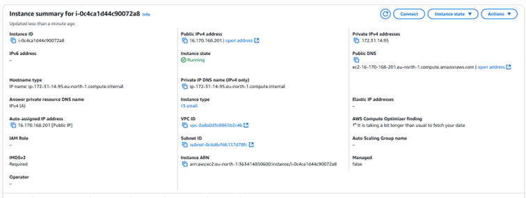
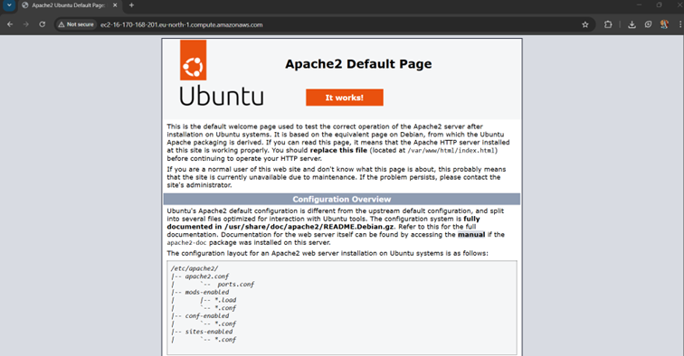
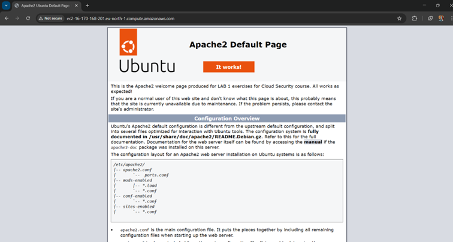
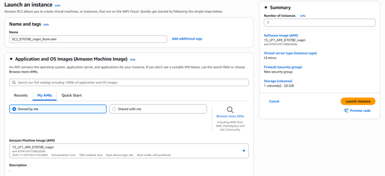

# [cite_start]Cloud Security (D7078E) LAB 1: AWS Fundamentals [cite: 1]
[cite_start]**Authors:** Ivana Pristavnik, Sebastian Ringström, Nenad Sekulic [cite: 4, 5, 6]  
[cite_start]**Date:** 21 November 2025 [cite: 7]

## 1. Introduction
[cite_start]This lab documents the exploration of the AWS Console with a focus on EC2 and IAM documentation[cite: 19, 20]. [cite_start]The primary goal was to create security groups, deploy EC2 instances, configure EBS volumes, and utilize AMIs to showcase various cloud functionalities[cite: 21, 22].

* [cite_start]**IAM:** A framework providing authentication, authorization, and access management[cite: 23].
* [cite_start]**EC2:** AWS service providing scalable computing capability designed for cost efficiency[cite: 25, 26].

---

## 2. Step-by-Step Lab Execution

### 2.1 Security Group Configuration
[cite_start]Security groups act as a virtual firewall for resources[cite: 29]. [cite_start]We created a group following the naming pattern `SEC_D7078E_ivpri` (noting a minor naming typo)[cite: 30, 33].
* [cite_start]**Inbound Rules:** SSH and HTTP rules were set for all locations[cite: 30].
* [cite_start]**Outbound Rules:** Open by default to allow all egress traffic[cite: 31].

[cite_start]*Figure 1: Security group creation [cite: 32]*

### 2.2 EC2 and EBS Setup
[cite_start]We provisioned an EC2 instance with the following specifications[cite: 36]:
* [cite_start]**AMI:** Ubuntu 24.04 (Free-tier eligible)[cite: 37, 38, 39].
* [cite_start]**Instance Type:** `t3.small` (General purpose)[cite: 40].
* [cite_start]**Storage:** EBS volume created with "delete on termination" disabled[cite: 43].
* [cite_start]**Access:** Assigned a custom key pair and associated with our previously created security group[cite: 41, 42].

[cite_start]*Figure 2: Summary for the created EC2 instance [cite: 46]*

### 2.3 Installing Apache Web Server
[cite_start]After connecting to the instance, we installed and customized the Apache2 server[cite: 55, 56]:

1. [cite_start]Elevate to root: `sudo -i` [cite: 57]
2. [cite_start]Update packages: `apt-get update` [cite: 58]
3. [cite_start]Install Apache: `apt-get install apache2` [cite: 59]

[cite_start]*Figure 4: Default HTML page via Public DNS [cite: 60, 61]*

[cite_start]We modified the `index.html` file located in `/var/www/html` using `vim` to verify live updates[cite: 62, 63].

[cite_start]*Figure 5: Edited HTML page showing custom lab text [cite: 64, 65]*

### 2.4 Testing "Launch More Like This"
[cite_start]We created a new instance using the 'launch more like this' option[cite: 66, 67]. 
* [cite_start]**Result:** No server response when navigating to the Public DNS[cite: 69].
* [cite_start]**Observation:** This occurs because the new instance uses a separate EBS volume and lacks the Apache installation present on the original instance[cite: 70].

### 2.5 AMI Creation and Persistence
[cite_start]To standardize the environment, we created an **AMI (Amazon Machine Image)** from our original instance[cite: 71, 72].

[cite_start]*Figure 7: Custom AMI includes root volume templates and software [cite: 73, 77, 78]*

[cite_start]When launching a new instance from this custom AMI, the software and edited `index.html` were immediately available[cite: 75, 76].

---

## 3. Conclusion
[cite_start]Custom AMIs are powerful tools for organizations to enforce security baselines and standardize developer environments[cite: 84, 85]. [cite_start]By pre-configuring security agents, patches, and access controls within an image, an organization significantly reduces risk in dynamic environments[cite: 86, 87].

---

## 4. Appendix & Resources
* [cite_start]**Command Reference:** For a quick-reference list of all terminal commands used in this lab, see [commands.txt](./commands.txt). [cite: 56, 57, 58, 59, 62]
* [cite_start]**EC2 Details:** Detailed instance summaries, including attached EBS volumes and security group rules, are documented in the appendix of the full lab report. [cite: 95, 96, 97, 98]